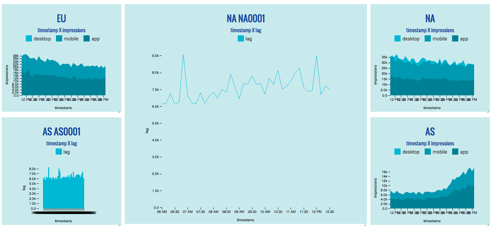

[react-d3-basic](https://github.com/react-d3/react-d3-basic)

##### Pros

- Nice documentation, simple and clear
- Easy to style

##### Cons

- Need more examples on how to parse the data for different charts
- Customized x-/y-axis is not flexible enough
