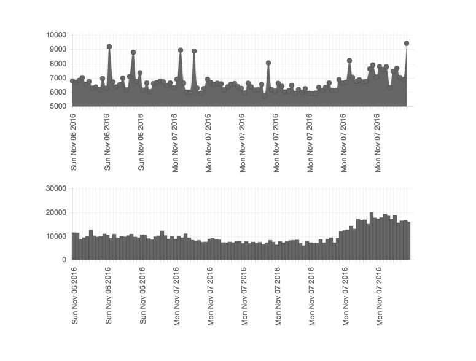

[react-chartjs](https://github.com/reactjs/react-chartjs)

##### Pros

- Use `labels` to represent x-axis, which is great that I can customize

##### Cons

- Not providing a clear react version documentation but uses [chartjs](http://www.chartjs.org/docs/)'s instead, which I don't really like because of the extensive information
- Demonstration page not clear with how the data look like
- Don't know why, but some of the `options` are not working, and I can't do the styling because of this
