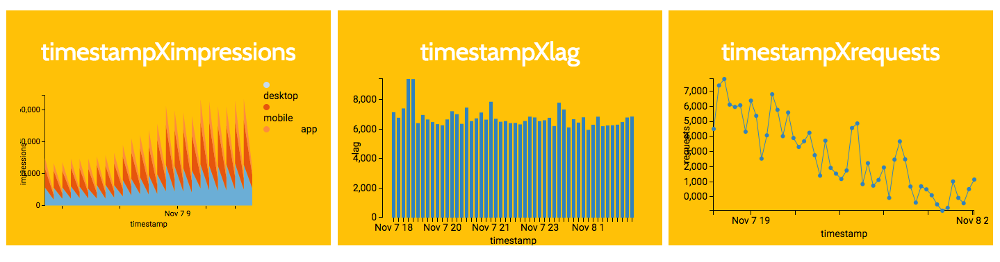

[react-d3](https://github.com/esbullington/react-d3)

##### Pros

- Nice demonstration page, simple and clear
- Parse the x/y coordinates ourselves, which can be more flexible (but also a con)

##### Cons

- The styling instructions are somehow hidden deep in the documentation
- Need to parse the x/y coordinates ourselves, which is more tedious (but also a pro)
- Customized x-/y-axis is not flexible enough (only found time on x-axis to be formattable, but the instructions are not clear)
